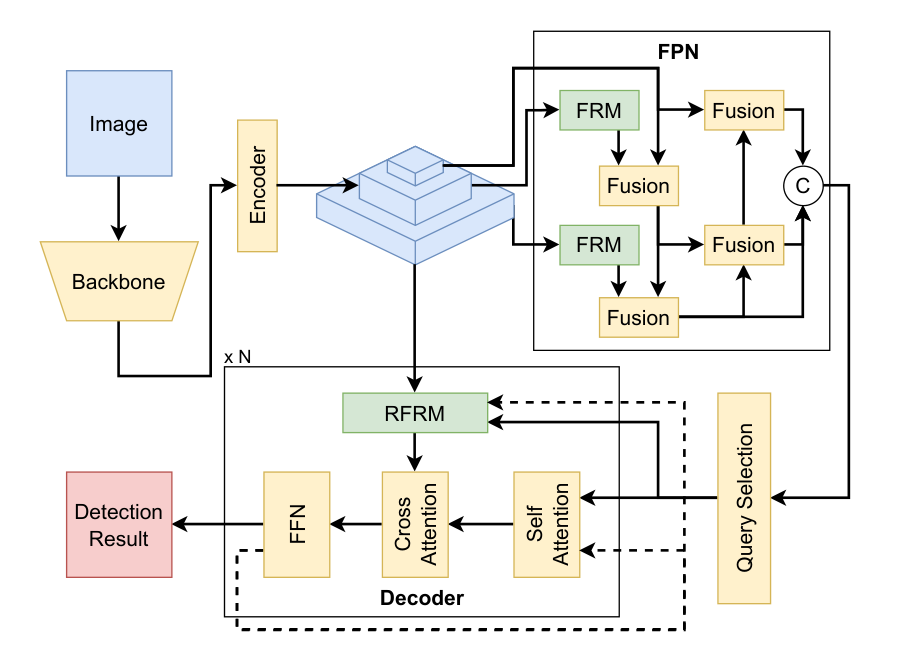
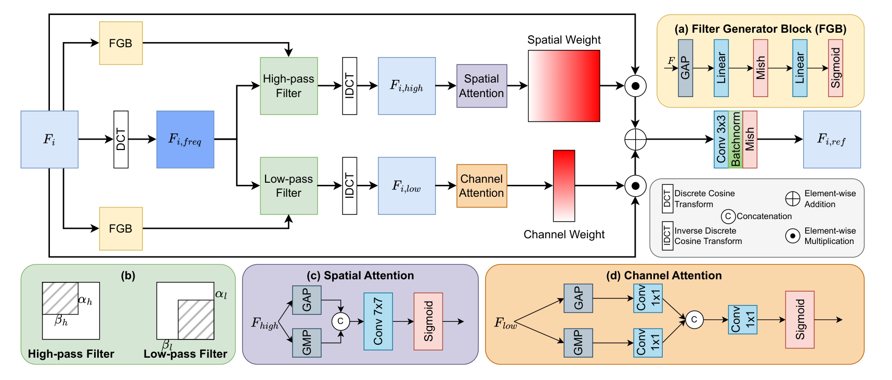
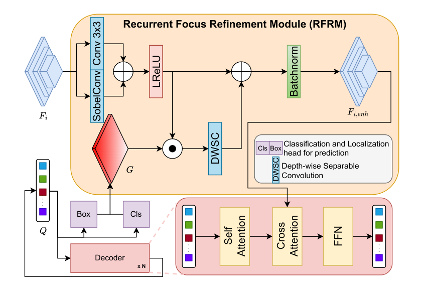

# FR-DETR

Official implementation for our paper accepted to ICME 2026.

This repository contains the implementation of FR-DETR, built on top of [MMDetection](https://github.com/open-mmlab/mmdetection), for object detection under degraded visual conditions.

<p align="center">
  
</p>

The main implementation file is:

- `mmdet/models/detectors/frdetr.py`

## Method

<p align="center">
  
</p>

<p align="center">
  
</p>

## Configs

The main training configs are:

- `config_rtdetr/frdetr_fog.py`: FR-DETR on foggy VOC-style data.
- `config_rtdetr/frdetr_dark.py`: FR-DETR on low-light VOC-style data.

These configs are adapted from an RT-DETR-style structure, but instantiate the `FRDETR` detector.

## Installation

This codebase follows the standard MMDetection installation flow. A Conda environment export is provided in `environment.yml`.

Tested core versions from the provided environment:

- Python 3.8.20
- PyTorch 2.0.1
- CUDA 11.8
- MMCV 2.0.1
- MMEngine 0.10.4

Create the environment and install the repo in development mode:

```bash
conda env create -f environment.yml
conda activate mmdet
pip install -e .
```

## Datasets

For foggy and low-light VOC-style experiments, please prepare the datasets following [Image-Adaptive-YOLO](https://github.com/wenyyu/Image-Adaptive-YOLO).

For adverse-weather experiments, please prepare the dataset following [MODE](https://github.com/Fsoft-AIC/MODE).

The config files currently contain local absolute paths from our training environment. Before training or testing, update the following fields in each config:

- `_base_`
- `pretrained`
- `data_root`
- `ann_file`
- `data_prefix`

The expected data format follows MMDetection's `VOCDataset` format.

## Training

Train FR-DETR on foggy data:

```bash
python tools/train.py config_rtdetr/frdetr_fog.py
```

Train FR-DETR on low-light data:

```bash
python tools/train.py config_rtdetr/frdetr_dark.py
```

## Testing

After training, evaluate a checkpoint with:

```bash
python tools/test.py config_rtdetr/frdetr_fog.py work_dirs/frdetr_fog/best.pth
```

or:

```bash
python tools/test.py config_rtdetr/frdetr_dark.py work_dirs/frdetr_dark/best.pth
```

## Citation

The citation for FR-DETR will be added after the arXiv or proceedings version is available.

This repository is based on MMDetection.
